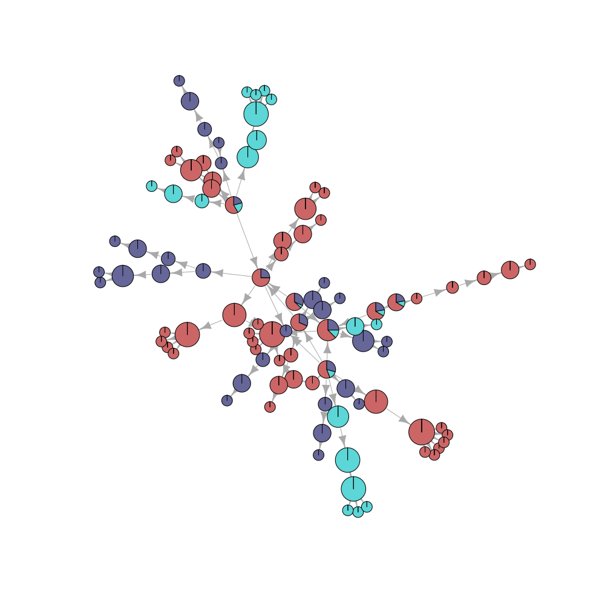

[](https://travis-ci.org/thibautjombart/dibbler)

[](https://codecov.io/github/thibautjombart/dibbler?branch=master)


*dibbler*: Investigation of food-borne disease outbreaks.

=================================================
*dibbler* provides tools for investigating food-borne outbreaks with (at least partly) known food distribution networks, and genetic information on the cases.
This document provides an overview of the package's content.


Installing *dibbler*
-------------
To install the development version from github:

```r
library(devtools)
install_github("thibautjombart/dibbler")
```

The stable version can be installed from CRAN using:

```r
install.packages("dibbler")
```

Then, to load the package, use:

```r
library("dibbler")
```


A short demo
------------------
Here is a short demonstration of the package using a dummy dataset.

We first generate a labelled network using *igraph*:

```r
library(igraph)
```

```
## 
## Attaching package: 'igraph'
```

```
## The following objects are masked from 'package:stats':
## 
##     decompose, spectrum
```

```
## The following object is masked from 'package:base':
## 
##     union
```

```r
set.seed(1)
g1 <- make_tree(20, 3)

## need this hack for named vertices
temp <- data.frame(lapply(
igraph2data.frame(g1), as.character),
stringsAsFactors=FALSE)
g1 <- graph.data.frame(temp)
```

Then we identify the 'tips' and generate draw cluster types from 4 clusters:

```r
tips <- which(degree(g1, mode="out")==0)
grp <- factor(sample(letters[1:4], replace=TRUE, size=length(tips)))
names(grp) <- tips
```

To run *dibbler*:

```r
out <- dibbler(dibbler.data(g1, grp), graph.opt=dibbler.graph.opt(max.size=15))
out
```

```
## $freq
## $freq$`1`
## 
##      a      b      c      d 
## 0.3077 0.1538 0.3077 0.2308 
## 
## $freq$`2`
## 
##      a      b      c      d 
## 0.4286 0.0000 0.4286 0.1429 
## 
## $freq$`3`
## 
##      a      b      c      d 
## 0.0000 0.6667 0.3333 0.0000 
## 
## $freq$`4`
## 
##      a      b      c      d 
## 0.3333 0.0000 0.0000 0.6667 
## 
## $freq$`5`
## 
##      a      b      c      d 
## 0.0000 0.0000 0.6667 0.3333 
## 
## $freq$`6`
## 
## a b c d 
## 1 0 0 0 
## 
## $freq$`7`
## 
## a b c d 
## 0 0 1 0 
## 
## $freq$`8`
## 
## a b c d 
## 0 1 0 0 
## 
## $freq$`9`
## 
## a b c d 
## 0 1 0 0 
## 
## $freq$`10`
## 
## a b c d 
## 0 0 1 0 
## 
## $freq$`11`
## 
## a b c d 
## 0 0 0 1 
## 
## $freq$`12`
## 
## a b c d 
## 1 0 0 0 
## 
## $freq$`13`
## 
## a b c d 
## 0 0 0 1 
## 
## $freq$`14`
## 
## a b c d 
## 0 0 0 1 
## 
## $freq$`15`
## 
## a b c d 
## 0 0 1 0 
## 
## $freq$`16`
## 
## a b c d 
## 0 0 1 0 
## 
## $freq$`17`
## 
## a b c d 
## 1 0 0 0 
## 
## $freq$`18`
## 
## a b c d 
## 1 0 0 0 
## 
## $freq$`19`
## 
## a b c d 
## 1 0 0 0 
## 
## $freq$`20`
## 
## a b c d 
## 0 0 1 0 
## 
## 
## $conf
##      1      2      3      4      5      6      7      8      9     10 
## 0.6500 0.6364 0.7500 0.7500 0.7500 0.7500 0.5000 1.0000 1.0000 1.0000 
##     11     12     13     14     15     16     17     18     19     20 
## 1.0000 1.0000 1.0000 1.0000 1.0000 1.0000 1.0000 1.0000 1.0000 1.0000 
## 
## $graph
## IGRAPH DN-- 20 19 -- 
## + attr: layout (g/n), name (v/c), shape (v/c), pie (v/x),
## | pie.color (v/x), size (v/n), label.family (v/c), label.color
## | (v/c)
## + edges (vertex names):
##  [1] 1->2  1->3  1->4  2->5  2->6  2->7  3->8  3->9  3->10 4->11 4->12
## [12] 4->13 5->14 5->15 5->16 6->17 6->18 6->19 7->20
```

```r
plot(out$graph, vertex.label="")
```



