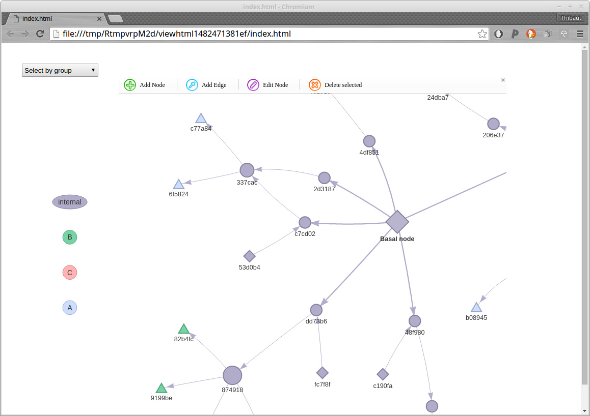

```{r setup, echo=FALSE}
# set global chunk options: images will be 7x7 inches
knitr::opts_chunk$set(fig.width=7, fig.height=7, fig.path="figs/", warning=FALSE)
options(digits = 4)
```


*dibbler*: investigation of food-borne disease outbreaks.
=================================================

> *And then you bit onto them, and learned once again that Cut-me-own-Throat Dibbler could find a
>   use for bits of an animal that the animal didn't know it had got. Dibbler had worked out that
>   with enough fried onions and mustard people would eat anything.*
[Terry Pratchett, Moving Pictures.]

*dibbler* provides tools for investigating food-borne outbreaks with (at least partly) known food distribution networks, and genetic information on the cases.
This document provides an overview of the package's content.


Installing *dibbler*
-------------
To install the development version from github:
```{r install, eval=FALSE}
library(devtools)
install_github("thibautjombart/dibbler")
```

The stable version can be installed from CRAN using:
```{r install2, eval=FALSE}
install.packages("dibbler")
```

Then, to load the package, use:
```{r load}
library("dibbler")
```


A short demo
------------------
Here is a short demonstration of the package using an anonymised Salmonella outbreak dataset.

All we need to run the method is:
1. a directed graph representing the **food network**, which can be provided as:
  - a `data.frame` with two columns (to,from)
  - a `igraph` object
  - a `network` object
2. a `factor` defining groups for some of the nodes of the network; this `factor` needs to be named, and the labels provided will be matched against the network.

Here, all this information is contained in the *Salmonella* dataset:
```{r salmo}
names(Salmonella)
head(Salmonella$graph)
Salmonella$cluster
```

We build a `igraph` object from the list of edges:
```{r g}
library(igraph)
g <- graph.data.frame(Salmonella$graph)
g
```

Data from the network and the genetic cluster can be merged and checked using `dibbler.data`.
The resulting object is a list with class `dibbler.data` with a dedicated plot method:
```{r input, out.width="800px", out.height="800px", fig.width=10, fig.height=10, dpi=100}
dat <- dibbler.data(graph=g, group=Salmonella$cluster)
names(dat)
dat$graph
dat$group
dat$lab.match
dat$id.basal
plot(dat)
```

The figure above shows terminal nodes as triangles, basal nodes as hexagons, and other nodes as circles.
The size of internal nodes is proportional to the number of immediately descending nodes (out-degree).
Annotation of the terminal nodes indicate genetic clusters.

Alternatively, we can also use `vis.dibbler.data` which exploits the *visNetwork* package to plot interactive networks:
```{r vis, eval=FALSE}
vis.dibbler.data(dat)
```


We can now run `dibbler` on the data, and examine the output.

The output items are:
- `$freq`: a list containing vectors of **estimated cluster frequencies** for each internal node of the graph
- `$conf`: a vector containing **confidence indices** for the estimates at each node; these are defined as the proportion of terminal nodes in the tree spanning from the node.
- `$graph`: an `igraph` object containing the above information in addition to the original network

The graph represent the inferred genetic composition of potential contamination using pie charts for each internal node. The size of the symbol is proportional to the 'confidence' associated to this give node.
```{r dibbler, out.width="800px", out.height="800px", fig.width=10, fig.height=10, dpi=100}
out <- dibbler(dat)
names(out)
head(out$freq)
head(out$conf)
out$graph
plot(out$graph, vertex.label="")
```


