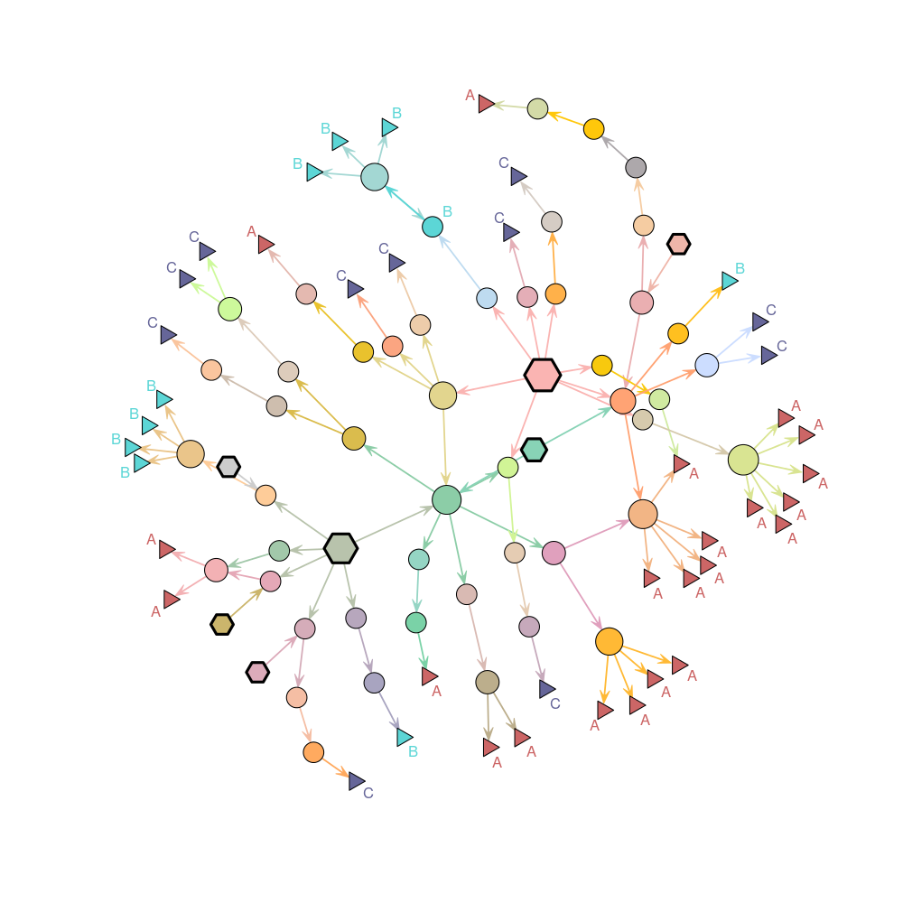

*dibbler*: investigation of food-borne disease outbreaks.
=================================================

> *And then you bit onto them, and learned once again that Cut-me-own-Throat Dibbler could find a
>   use for bits of an animal that the animal didn't know it had got. Dibbler had worked out that
>   with enough fried onions and mustard people would eat anything.*
[Terry Pratchett, Moving Pictures.]

*dibbler* provides tools for investigating food-borne outbreaks with (at least partly) known food distribution networks, and genetic information on the cases.
This document provides an overview of the package's content.


Installing *dibbler*
-------------
To install the development version from github:

```r
library(devtools)
install_github("thibautjombart/dibbler")
```

The stable version can be installed from CRAN using:

```r
install.packages("dibbler")
```

Then, to load the package, use:

```r
library("dibbler")
```


A short demo
------------------
Here is a short demonstration of the package using an anonymised Salmonella outbreak dataset.

All we need to run the method is:
1. a directed graph representing the **food network**, which can be provided as:
  - a `data.frame` with two columns (to,from)
  - a `igraph` object
  - a `network` object
2. a `factor` defining groups for some of the nodes of the network; this `factor` needs to be named, and the labels provided will be matched against the network.

Here, all this information is contained in the *Salmonella* dataset:

```r
names(Salmonella)
```

```
## [1] "graph"   "cluster"
```

```r
head(Salmonella$graph)
```

```
##     from     to
## 1 2e7967 dd73b6
## 2 2e7967 c7cd02
## 3 2e7967 2afba4
## 4 2e7967 4df851
## 5 2e7967 48f980
## 6 2e7967 2d3187
```

```r
Salmonella$cluster
```

```
## d81c17 064974 3b712b 486c07 6f5824 c77a84 1f4d22 f951d8 44060b 905296 
##      A      A      A      A      A      A      A      A      A      A 
## b4e5d5 0fffca 78e5ba e45c54 ca432a 0b6e5a ef7028 732379 82b4fc 9199be 
##      A      B      B      B      B      B      B      B      B      B 
## cede47 9f5aad acf7bb 24876f 37aad9 1e7431 0b57e4 09f4a0 a6fcaf f59e4b 
##      B      C      C      C      C      C      C      C      C      C 
## 1b55d2 7d3df0 b08945 f80b2e efee6b 6e0643 252679 35a9b6 80afad 1569a5 
##      C      C      A      A      A      A      A      A      A      A 
## 161814 c09e12 38881f 
##      A      A      A 
## Levels: A B C
```

We build a `igraph` object from the list of edges:

```r
library(igraph)
g <- graph.data.frame(Salmonella$graph)
g
```

```
## IGRAPH DN-- 98 103 -- 
## + attr: name (v/c)
## + edges (vertex names):
##  [1] 2e7967->dd73b6 2e7967->c7cd02 2e7967->2afba4 2e7967->4df851
##  [5] 2e7967->48f980 2e7967->2d3187 cd48bf->e42c72 cd48bf->7d21f1
##  [9] dd73b6->874918 7ba446->f83f2e 642cb4->327734 c7cd02->337cac
## [13] 5b44d7->f7fc94 5b44d7->2fabc7 2afba4->5b44d7 2afba4->c1dc98
## [17] 2afba4->b16cf0 2afba4->206e37 2afba4->958de8 fc7f8f->dd73b6
## [21] 963c41->acf7bb 963c41->9f5aad f60e85->4941c6 4941c6->0b57e4
## [25] 53d0b4->c7cd02 13dc78->0b6e5a 13dc78->78e5ba 13dc78->ca432a
## [29] 13dc78->e45c54 9c0e59->80afad 6ddfa3->a7a903 3301f4->7ba446
## + ... omitted several edges
```

Data from the network and the genetic cluster can be merged and checked using `dibbler.data`.
The resulting object is a list with class `dibbler.input` with a dedicated plot method:

```r
dat <- dibbler.data(graph=g, group=Salmonella$cluster)
names(dat)
```

```
##  [1] "graph"          "group"          "lab.graph"      "lab.group"     
##  [5] "lab.match"      "id.graph.match" "id.group.match" "id.terminal"   
##  [9] "id.internal"    "id.basal"       "lab.terminal"   "lab.internal"  
## [13] "lab.basal"
```

```r
dat$graph
```

```
## IGRAPH DN-- 98 103 -- 
## + attr: name (v/c)
## + edges (vertex names):
##  [1] 2e7967->dd73b6 2e7967->c7cd02 2e7967->2afba4 2e7967->4df851
##  [5] 2e7967->48f980 2e7967->2d3187 cd48bf->e42c72 cd48bf->7d21f1
##  [9] dd73b6->874918 7ba446->f83f2e 642cb4->327734 c7cd02->337cac
## [13] 5b44d7->f7fc94 5b44d7->2fabc7 2afba4->5b44d7 2afba4->c1dc98
## [17] 2afba4->b16cf0 2afba4->206e37 2afba4->958de8 fc7f8f->dd73b6
## [21] 963c41->acf7bb 963c41->9f5aad f60e85->4941c6 4941c6->0b57e4
## [25] 53d0b4->c7cd02 13dc78->0b6e5a 13dc78->78e5ba 13dc78->ca432a
## [29] 13dc78->e45c54 9c0e59->80afad 6ddfa3->a7a903 3301f4->7ba446
## + ... omitted several edges
```

```r
dat$group
```

```
## d81c17 064974 3b712b 486c07 6f5824 c77a84 1f4d22 f951d8 44060b 905296 
##      A      A      A      A      A      A      A      A      A      A 
## b4e5d5 0fffca 78e5ba e45c54 ca432a 0b6e5a ef7028 732379 82b4fc 9199be 
##      A      B      B      B      B      B      B      B      B      B 
## cede47 9f5aad acf7bb 24876f 37aad9 1e7431 0b57e4 09f4a0 a6fcaf f59e4b 
##      B      C      C      C      C      C      C      C      C      C 
## 1b55d2 7d3df0 b08945 f80b2e efee6b 6e0643 252679 35a9b6 80afad 1569a5 
##      C      C      A      A      A      A      A      A      A      A 
## 161814 c09e12 38881f 
##      A      A      A 
## Levels: A B C
```

```r
dat$lab.match
```

```
##  [1] "0b6e5a" "acf7bb" "9f5aad" "0b57e4" "78e5ba" "ca432a" "e45c54"
##  [8] "80afad" "cede47" "82b4fc" "732379" "9199be" "7d3df0" "c77a84"
## [15] "6f5824" "3b712b" "1e7431" "37aad9" "44060b" "905296" "f951d8"
## [22] "b4e5d5" "1b55d2" "a6fcaf" "24876f" "0fffca" "09f4a0" "38881f"
## [29] "d81c17" "1569a5" "064974" "161814" "c09e12" "b08945" "f80b2e"
## [36] "35a9b6" "6e0643" "efee6b" "252679" "f59e4b" "ef7028" "1f4d22"
## [43] "486c07"
```

```r
dat$id.basal
```

```
## [1]  1  9 13 17 21 26 38
```

```r
plot(dat)
```



The figure above shows terminal nodes as triangles, basal nodes as hexagons, and other nodes as circles.
The size of internal nodes is proportional to the number of immediately descending nodes (out-degree).
Annotation of the terminal nodes indicate genetic clusters.

Alternatively, we can also use `vis.dibbler.data` which exploits the *visNetwork* package to plot interactive networks:

```r
vis.dibbler.input(dat)
```

<!--html_preserve--><div id="htmlwidget-7048" style="width:504px;height:504px;" class="visNetwork"></div>
<script type="application/json" data-for="htmlwidget-7048">{"x":{"nodes":{"id":["2e7967","cd48bf","dd73b6","7ba446","642cb4","c7cd02","5b44d7","2afba4","fc7f8f","963c41","f60e85","4941c6","53d0b4","13dc78","9c0e59","6ddfa3","3301f4","874918","f46d1e","0b6e5a","c190fa","337cac","03eee3","c1dc98","a7a903","d2d08f","030327","6d4b91","76a432","7fa3b1","f83f2e","881955","e42c72","4df851","d4d75e","7be343","735807","238842","3e93ce","f7fc94","8e02f0","b16cf0","51ca98","81e071","dc72e8","4e2918","2fabc7","ad208a","48f980","24dba7","327734","4e8dc8","206e37","958de8","2d3187","7d21f1","acf7bb","9f5aad","0b57e4","78e5ba","ca432a","e45c54","80afad","cede47","82b4fc","732379","9199be","7d3df0","c77a84","6f5824","3b712b","1e7431","37aad9","44060b","905296","f951d8","b4e5d5","1b55d2","a6fcaf","24876f","0fffca","09f4a0","38881f","d81c17","1569a5","064974","161814","c09e12","b08945","f80b2e","35a9b6","6e0643","efee6b","252679","f59e4b","ef7028","1f4d22","486c07"],"label":["2e7967","cd48bf","dd73b6","7ba446","642cb4","c7cd02","5b44d7","2afba4","fc7f8f","963c41","f60e85","4941c6","53d0b4","13dc78","9c0e59","6ddfa3","3301f4","874918","f46d1e","0b6e5a","c190fa","337cac","03eee3","c1dc98","a7a903","d2d08f","030327","6d4b91","76a432","7fa3b1","f83f2e","881955","e42c72","4df851","d4d75e","7be343","735807","238842","3e93ce","f7fc94","8e02f0","b16cf0","51ca98","81e071","dc72e8","4e2918","2fabc7","ad208a","48f980","24dba7","327734","4e8dc8","206e37","958de8","2d3187","7d21f1","acf7bb","9f5aad","0b57e4","78e5ba","ca432a","e45c54","80afad","cede47","82b4fc","732379","9199be","7d3df0","c77a84","6f5824","3b712b","1e7431","37aad9","44060b","905296","f951d8","b4e5d5","1b55d2","a6fcaf","24876f","0fffca","09f4a0","38881f","d81c17","1569a5","064974","161814","c09e12","b08945","f80b2e","35a9b6","6e0643","efee6b","252679","f59e4b","ef7028","1f4d22","486c07"],"group":["internal","internal","internal","internal","internal","internal","internal","internal","internal","internal","internal","internal","internal","internal","internal","internal","internal","internal","internal","B","internal","internal","internal","internal","internal","internal","internal","internal","internal","internal","internal","internal","internal","internal","internal","internal","internal","internal","internal","internal","internal","internal","internal","internal","internal","internal","internal","internal","internal","internal","internal","internal","internal","internal","internal","internal","C","C","C","B","B","B","A","B","B","B","B","C","A","A","A","C","C","A","A","A","A","C","C","C","B","C","A","A","A","A","A","A","A","A","A","A","A","A","C","B","A","A"],"shape":["diamond","dot","dot","dot","dot","dot","dot","dot","diamond","dot","dot","dot","diamond","dot","dot","dot","diamond","dot","dot","dot","diamond","dot","dot","dot","dot","diamond","dot","dot","dot","dot","dot","dot","dot","dot","dot","dot","dot","diamond","dot","dot","dot","dot","dot","dot","dot","dot","dot","dot","dot","dot","dot","dot","dot","dot","dot","dot","triangle","triangle","triangle","triangle","triangle","triangle","triangle","triangle","triangle","triangle","triangle","triangle","triangle","triangle","triangle","triangle","triangle","triangle","triangle","triangle","triangle","triangle","triangle","triangle","triangle","triangle","triangle","triangle","triangle","triangle","triangle","triangle","triangle","triangle","triangle","triangle","triangle","triangle","triangle","triangle","triangle","triangle"],"value":[6,2,1,1,1,1,2,5,1,2,1,1,1,4,1,1,8,4,1,1,1,2,1,2,1,1,2,1,4,1,1,4,1,1,1,1,1,2,1,1,6,1,2,5,1,1,1,1,1,1,1,1,1,1,1,3,0,0,0,0,0,0,0,0,0,0,0,0,0,0,0,0,0,0,0,0,0,0,0,0,0,0,0,0,0,0,0,0,0,0,0,0,0,0,0,0,0,0]},"edges":{"from":["2e7967","2e7967","2e7967","2e7967","2e7967","2e7967","cd48bf","cd48bf","dd73b6","7ba446","642cb4","c7cd02","5b44d7","5b44d7","2afba4","2afba4","2afba4","2afba4","2afba4","fc7f8f","963c41","963c41","f60e85","4941c6","53d0b4","13dc78","13dc78","13dc78","13dc78","9c0e59","6ddfa3","3301f4","3301f4","3301f4","3301f4","3301f4","3301f4","3301f4","3301f4","874918","874918","874918","874918","f46d1e","0b6e5a","c190fa","337cac","337cac","03eee3","c1dc98","c1dc98","a7a903","d2d08f","030327","030327","6d4b91","76a432","76a432","76a432","76a432","7fa3b1","f83f2e","881955","881955","881955","881955","e42c72","4df851","d4d75e","7be343","735807","238842","238842","3e93ce","f7fc94","8e02f0","8e02f0","8e02f0","8e02f0","8e02f0","8e02f0","b16cf0","51ca98","51ca98","81e071","81e071","81e071","81e071","81e071","dc72e8","4e2918","2fabc7","ad208a","48f980","24dba7","327734","4e8dc8","206e37","958de8","2d3187","7d21f1","7d21f1","7d21f1"],"to":["dd73b6","c7cd02","2afba4","4df851","48f980","2d3187","e42c72","7d21f1","874918","f83f2e","327734","337cac","f7fc94","2fabc7","5b44d7","c1dc98","b16cf0","206e37","958de8","dd73b6","acf7bb","9f5aad","4941c6","0b57e4","c7cd02","0b6e5a","78e5ba","ca432a","e45c54","80afad","a7a903","7ba446","03eee3","6d4b91","881955","3e93ce","ad208a","958de8","7d21f1","cede47","82b4fc","732379","9199be","7d3df0","13dc78","48f980","c77a84","6f5824","0b6e5a","76a432","81e071","3b712b","cd48bf","1e7431","37aad9","9c0e59","44060b","905296","f951d8","b4e5d5","1b55d2","a6fcaf","642cb4","2afba4","f46d1e","7fa3b1","4e8dc8","4e2918","7be343","24876f","0fffca","2afba4","7d21f1","09f4a0","963c41","38881f","d81c17","1569a5","064974","161814","c09e12","51ca98","b08945","f80b2e","80afad","35a9b6","6e0643","efee6b","252679","f59e4b","ef7028","dc72e8","8e02f0","d4d75e","1f4d22","486c07","6ddfa3","24dba7","f60e85","337cac","030327","735807","81e071"],"arrows":["to","to","to","to","to","to","to","to","to","to","to","to","to","to","to","to","to","to","to","to","to","to","to","to","to","to","to","to","to","to","to","to","to","to","to","to","to","to","to","to","to","to","to","to","to","to","to","to","to","to","to","to","to","to","to","to","to","to","to","to","to","to","to","to","to","to","to","to","to","to","to","to","to","to","to","to","to","to","to","to","to","to","to","to","to","to","to","to","to","to","to","to","to","to","to","to","to","to","to","to","to","to","to"],"color":["#ffbf80","#ffbf80","#ffbf80","#ffbf80","#ffbf80","#ffbf80","#ffbf80","#ffbf80","#ffbf80","#ffbf80","#ffbf80","#ffbf80","#ffbf80","#ffbf80","#ffbf80","#ffbf80","#ffbf80","#ffbf80","#ffbf80","#ffbf80","#ffbf80","#ffbf80","#ffbf80","#ffbf80","#ffbf80","#ffbf80","#ffbf80","#ffbf80","#ffbf80","#ffbf80","#ffbf80","#ffbf80","#ffbf80","#ffbf80","#ffbf80","#ffbf80","#ffbf80","#ffbf80","#ffbf80","#ffbf80","#ffbf80","#ffbf80","#ffbf80","#ffbf80","#ffbf80","#ffbf80","#ffbf80","#ffbf80","#ffbf80","#ffbf80","#ffbf80","#ffbf80","#ffbf80","#ffbf80","#ffbf80","#ffbf80","#ffbf80","#ffbf80","#ffbf80","#ffbf80","#ffbf80","#ffbf80","#ffbf80","#ffbf80","#ffbf80","#ffbf80","#ffbf80","#ffbf80","#ffbf80","#ffbf80","#ffbf80","#ffbf80","#ffbf80","#ffbf80","#ffbf80","#ffbf80","#ffbf80","#ffbf80","#ffbf80","#ffbf80","#ffbf80","#ffbf80","#ffbf80","#ffbf80","#ffbf80","#ffbf80","#ffbf80","#ffbf80","#ffbf80","#ffbf80","#ffbf80","#ffbf80","#ffbf80","#ffbf80","#ffbf80","#ffbf80","#ffbf80","#ffbf80","#ffbf80","#ffbf80","#ffbf80","#ffbf80","#ffbf80"]},"options":{"width":"100%","height":"100%","nodes":{"shape":"dot","borderWidth":2},"manipulation":{"enabled":true},"groups":{"internal":{"color":"#ffbf80"},"A":{"color":"#CC6666"},"B":{"color":"#5CD6D6"},"useDefaultGroups":true,"C":{"color":"#666699"}}},"groups":["internal","B","C","A"],"width":null,"height":null,"idselection":{"enabled":false,"style":"width: 150px; height: 26px"},"byselection":{"enabled":true,"style":"width: 150px; height: 26px","variable":"group","values":["A","B","C","internal"]},"legend":{"width":0.2,"useGroups":true,"position":"left"},"datacss":"table.legend_table {\n  font-size: 11px;\n  border-width:1px;\n  border-color:#d3d3d3;\n  border-style:solid;\n}\ntable.legend_table,td {\n  border-width:1px;\n  border-color:#d3d3d3;\n  border-style:solid;\n  padding: 2px;\n}\ndiv.table_content {\n  width:80px;\n  text-align:center;\n}\ndiv.table_description {\n  width:100px;\n}\n\n#operation {\n  font-size:28px;\n}\n#network-popUp {\n  display:none;\n  z-index:299;\n  width:250px;\n  height:150px;\n  background-color: #f9f9f9;\n  border-style:solid;\n  border-width:3px;\n  border-color: #5394ed;\n  padding:10px;\n  text-align: center;\n  position:fixed;\n  top:50%;  \n  left:50%;  \n  margin:-100px 0 0 -100px;  \n\n}","highlight":false,"degree":1},"evals":[]}</script><!--/html_preserve-->

We can now run `dibbler` on the data, and examine the output.

The output items are:
- `$freq`: a list containing vectors of **estimated cluster frequencies** for each internal node of the graph
- `$conf`: a vector containing **confidence indices** for the estimates at each node; these are defined as the proportion of terminal nodes in the tree spanning from the node.
- `$graph`: an `igraph` object containing the above information in addition to the original network

The graph represent the inferred genetic composition of potential contamination using pie charts for each internal node. The size of the symbol is proportional to the 'confidence' associated to this give node.

```r
out <- dibbler(dat)
names(out)
```

```
## [1] "freq"  "conf"  "graph"
```

```r
head(out$freq)
```

```
## $`2e7967`
## 
##      A      B      C 
## 0.5833 0.2083 0.2083 
## 
## $cd48bf
## 
##      A      B      C 
## 0.6667 0.1111 0.2222 
## 
## $dd73b6
## 
## A B C 
## 0 1 0 
## 
## $`7ba446`
## 
## A B C 
## 0 0 1 
## 
## $`642cb4`
## 
## A B C 
## 1 0 0 
## 
## $c7cd02
## 
## A B C 
## 1 0 0
```

```r
head(out$conf)
```

```
## 2e7967 cd48bf dd73b6 7ba446 642cb4 c7cd02 
## 0.4706 0.5000 0.6667 0.3333 0.3333 0.5000
```

```r
out$graph
```

```
## IGRAPH DN-- 98 103 -- 
## + attr: layout (g/n), name (v/c), shape (v/c), pie (v/x),
## | pie.color (v/x), size (v/n), label.family (v/c), label.color
## | (v/c)
## + edges (vertex names):
##  [1] 2e7967->dd73b6 2e7967->c7cd02 2e7967->2afba4 2e7967->4df851
##  [5] 2e7967->48f980 2e7967->2d3187 cd48bf->e42c72 cd48bf->7d21f1
##  [9] dd73b6->874918 7ba446->f83f2e 642cb4->327734 c7cd02->337cac
## [13] 5b44d7->f7fc94 5b44d7->2fabc7 2afba4->5b44d7 2afba4->c1dc98
## [17] 2afba4->b16cf0 2afba4->206e37 2afba4->958de8 fc7f8f->dd73b6
## [21] 963c41->acf7bb 963c41->9f5aad f60e85->4941c6 4941c6->0b57e4
## + ... omitted several edges
```

```r
plot(out$graph, vertex.label="")
```


